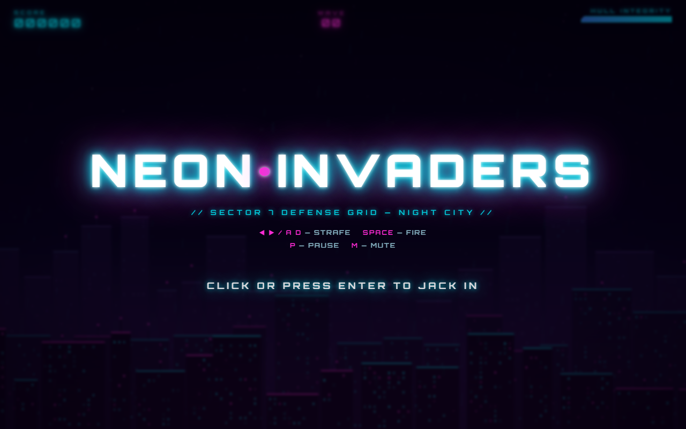
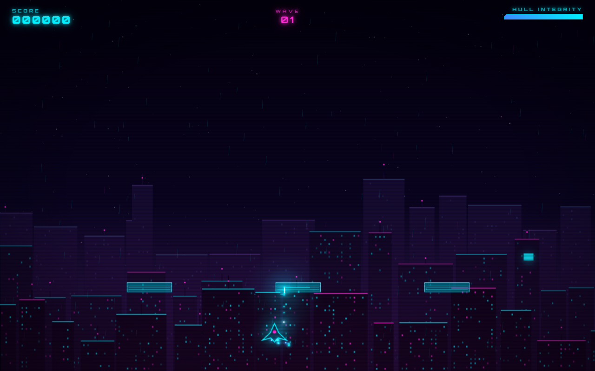

# NEON INVADERS

A cyberpunk take on Space Invaders — a single-file HTML5 canvas arcade shooter set over a neon Night City skyline. No build step, no dependencies: just open `index.html`.



## Gameplay



## Features

- **Pure canvas rendering** — pre-rendered glow sprites, no per-frame `shadowBlur`, so the neon holds 60 fps.
- **Fixed-timestep physics** — input is decoupled from the render loop; listeners only flip flags, physics polls them with delta time.
- **Parallax Night City** — three procedurally generated skyline layers, a starfield, and neon rain, all rebuilt on resize.
- **Juice** — hit-stop, slow-mo boss deaths, screen shake, combo multipliers, floating score popups, CRT scanline + vignette overlay.
- **Waves, divers & bosses** — kamikaze divers from wave 2, a DREADNOUGHT boss every 5th wave with fan / aimed-burst / rain attack patterns.
- **Power-ups** — Triple Shot, Overdrive (rapid fire), Shield, Hull repair.
- **Web Audio** — all SFX synthesized at runtime (no audio files).
- **High score** — persisted in `localStorage`.

## Controls

| Key | Action |
|-----|--------|
| `◀ ▶` / `A` `D` | Strafe |
| `Space` / `W` / `▲` | Fire |
| `P` | Pause |
| `M` | Mute |
| `Enter` / Click | Start / Restart |

## Run locally

It's a static file — any of these work:

```bash
# Python
python -m http.server 4173
# then open http://localhost:4173

# or just open the file directly
open index.html      # macOS
start index.html     # Windows
```

## Deploy

Static site, zero config. Deploy the folder to any static host. On [Vercel](https://vercel.com):

```bash
vercel --prod
```

## Tech

Vanilla JavaScript + HTML5 Canvas + Web Audio API. One file, no dependencies.
